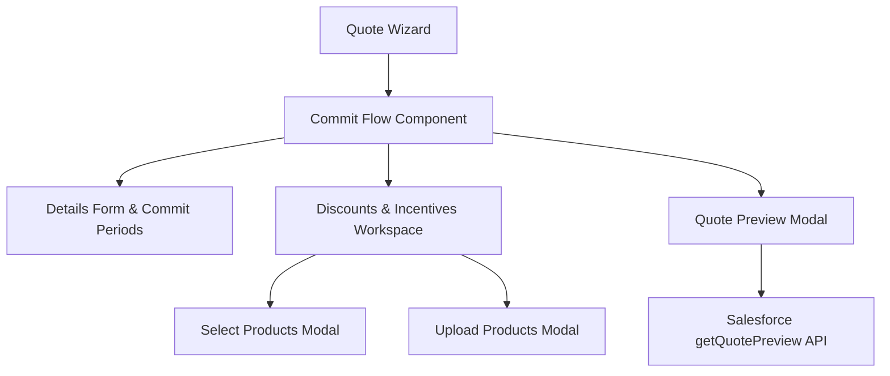
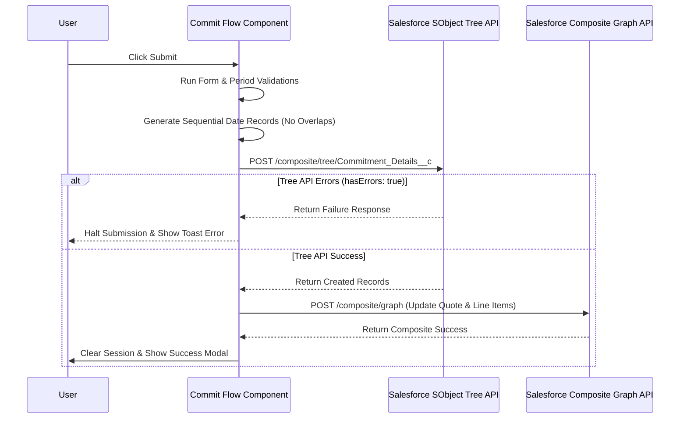

# Sub-Feature Specification: Quote Commit Flow (Standard & Looker)

**Part of Feature**: `001-quote-subscription-flow`

---

## 1. Overview & Architecture

The Commit Flow allows sales representatives to define contractual commitment terms (durations and amounts) or Looker subscription periods for a Salesforce Quote. In addition to base commitment structures, it provides a comprehensive "Discounts and Incentives" workspace to configure overall or granular price modifications over specific date ranges.

The system is split into:
1. **CommitFlowComponent**: The parent controller orchestrating the main tabs, validation, calculations, and the sequential Salesforce API submission.
2. **SelectProductsModalComponent**: The faceted search, filtering, sorting, and manual selection interface for applying granular discounts/incentives.
3. **UploadProductsModalComponent**: The bulk file parsing utility using CSVs to automate granular selections.
4. **QuotePreviewModalComponent**: The read-only simulation window querying live Salesforce Quote Line Items or falling back to local configurations.



---

## 2. Core Functional Blocks

### 2.1 Header & Quote Metadata
The workspace header displays real-time CRM info dynamically synced from the parent wizard component state, originally retrieved from the Salesforce Quote details APIs:
*   **Account Name (Top Left)**: Fetched dynamically via the Quote's Account relationship API endpoint. Displays at the very top left of the workspace (e.g. `AndeanCloud Analytics SpA`).
*   **Opportunity Name (Top Right)**: Fetched dynamically via the Quote's Opportunity relationship API. Displays at the top right header (e.g. `CRE Opp`).
*   **Q-Number**: Displays the unique Salesforce Quote Number (e.g. `Q-00005148`) under the main heading on the left.
*   **Primary Contact**: Binded to the Quote's primary contact details, prefilled dynamically in the details panel form.
*   **Sales Channel**: Binded to the Quote's sales channel field (e.g. `Direct`, `Indirect`).
*   **Contract Start Date**: Automatically initialized client-side to the current system date formatted as `dd-mm-yyyy` (e.g., `13-07-2026`).
*   **Expiration Date**: Retrieved from Quote's expiration date metadata and binded to the form controller.

### 2.2 Commitment Values & Calculations
*   **Dynamic Inputs**: Receives dynamic bindings from parent components (`quoteDetails`, `paymentAccount`, and the reactive `detailsForm`). When quote metadata changes, the header fields (Account Name, Opportunity Name, Q-Number) and fields like Primary Contact, Sales Channel, and Start/Expiration dates update in real-time.
*   **Default Date Logic**: Prefills a dynamic start date formatted as `dd-mm-yyyy` (today's date) and binds the expiration date from Salesforce quote metadata.
*   **Multiplier Suffixes**: Inputs in the Period Amount field support shorthand parsing:
    *   `k` or `K`: Thousands (e.g., `250k` parses to `250,000`).
    *   `m` or `M`: Millions (e.g., `12m` parses to `12,000,000`).
    *   `b` or `B`: Billions (e.g., `2.5b` parses to `2,500,000,000`).
*   **Reactive Totals**: Emits dynamic calculations via the `totalsChanged` event, summing all period months and parsed values.
*   **Period Management**: Representatives can add, duplicate, or delete commitment periods dynamically (supporting up to 5 total periods).
*   **Capacity Counter**: Displays remaining products capacity counts in real-time using a dynamic calculation (`999 - selectedCount`).

---

### 2.2 Discounts & Incentives Workspace
*   **Collapsible Overlay Cards**: Representatives configure multiple overlapping discount or incentive periods.
*   **Discount Configurations**:
    *   *Time Period*: Custom start and end date ranges.
    *   *Granularity*: `Overall` (applies the discount value across all products) or `Granular` (prompts specific discounts per product).
    *   *Discount Type*: flat rate percentage (`Flat rate (%)`) or fixed cash amounts.
    *   *Price Reference*: reference rate selector.
    *   *Overall Value*: discount percentage input (visible only for `Overall` granularity).
*   **Incentive Configurations**:
    *   *Time Period*: Custom start and end date ranges.
    *   *Incentive Type*: selector for incentive classification type (e.g., "Incentives type 1").
    *   *Incentive Amount*: currency amount configuration.
*   **Salesforce Sync API**: Applies configured updates dynamically to Salesforce quote lines via:
    *   `CrmService.applyBulkDiscounts(value, type, products, startDate, endDate)`

---

### 2.3 Product Search & Discovery (Faceted & Global)
The `SelectProductsModalComponent` hosts the search and selection engine.

*   **Active Tabs**:
    *   *Product Groups*: Fetches active product bundles via CRM service APIs.
    *   *Individual Products*: Lists standalone products.
*   **Faceted Category Search**:
    *   Displays pill buttons representing category facets (e.g., "Compute", "Kubernetes", "Storage").
    *   Clicking a facet triggers `facetedProductSearch(categoryId, '')` to filter.
    *   Clicking the same facet a second time toggles the category facet off (clearing it to `null`).
*   **Global Search**:
    *   A search box input query mapped to `onSearchChange(term)`.
    *   **Debouncing**: Keystrokes are debounced for `300ms` before triggering a network query to prevent server overload.
*   **Product List Sorting**:
    *   Includes a name sorting header toggled via `toggleSort()`.
    *   Toggles alphabetical sorting between **Ascending** and **Descending**.
*   **Selection Filters**:
    *   Filters list views between `All` (complete product list) and `Selected` (only checked items).
    *   Includes a master checkbox supporting bulk `Select All` and `Deselect All` actions.
*   **Granular Validation**:
    *   `isValidToConfirm()` ensures that in `Granular` mode, all checked products have non-empty discount/incentive values entered before enabling confirmation.

---

### 2.4 Bulk Uploads Modal
*   **Structure**: Allows drag-and-drop uploading of CSV files.
*   **Shorthand Processing**: Parses columns mapping `Product SKU` or `ID` alongside discount/incentive amounts.
*   **Templates**: Provides a template download link to guarantee data format compliance.

---

### 2.5 Live Quote Preview Modal
*   **Layout**: Displays a read-only tabular breakdown of:
    *   *Quote Summary*: Net total calculations.
    *   *Commitment Details*: Months, dates, and amounts.
    *   *Discount & Incentive Periods*: Displays applied discounts/incentives per product group.
*   **Price Reference Columns Rule**: Based on user requests, the `Price reference` column is fully excluded from the Discount Period tables in this preview modal.
*   **API Queries**: On init, queries `CrmService.getQuotePreview(quoteId)` to retrieve existing quote lines and Salesforce-managed records.
*   **Graceful Fallback**: If the Salesforce API query fails (e.g., net connectivity issues or timeout), the preview gracefully falls back to displaying the client-side configuration arrays to avoid UI blocking.

### 2.6 UI & Design Aesthetic
The Commit Flow and its associated modals must adhere to a premium, enterprise-grade tabular design language.

*   **Modal Layout & Framing**: 
    *   Modals use a full-screen or large centered layout with a frosted glass backdrop (`rgba(15, 23, 42, 0.65)`, `backdrop-filter: blur(6px)`).
    *   Headers contain bold typography (e.g., `<h2>Quote Preview</h2>`) with a right-aligned minimalist `✕` close button.
*   **Table Theming & Colors**:
    *   **Blue Theme (Primary Details)**: Tables like "Quote summary", "Commitment Details", and "Product" use a vibrant blue header background (`#1a73e8` or similar) with crisp white text.
    *   **Purple Theme (Discount/Incentive Details)**: Secondary nested tables (like inside Discount Periods) use a distinct purple header background to differentiate from standard product lists.
*   **Typography & Grids**:
    *   Use a clean sans-serif font (e.g., Inter or Roboto).
    *   Table headers (`<th>`) must be left-aligned with ample padding (e.g., `12px 16px`) and bold styling.
    *   Table rows alternate with subtle borders (`1px solid #e2e8f0`) and hover states.
    *   Sub-headers or span rows (like the Quote Number / Quote Name row) sit directly below the main blue header with a lighter gray background (`#f8fafc`).
*   **Hierarchical Spacing**:
    *   Use generous margins (e.g., `mb-6`, `mb-8`) between distinct sections like "Quote summary" and "Commitment Details" to prevent visual crowding.

---

## 3. Salesforce Integration APIs & Submission Sequence

When the user submits the quote, the system executes a strict multi-step sequential integration flow:



### 3.1 Step 1: Validation
*   Validates `detailsForm` fields.
*   Ensures that every period has valid non-empty months and amount configurations.

### 3.2 Step 2: Date Sequence Calculations
*   Start and End dates are computed sequentially.
*   The first period starts on the quote start date.
*   Subsequent periods start on the previous period's End Date + 1 day to ensure there are no overlapping dates or calendar gaps.

### 3.3 Step 3: Commitment Tree API
*   **Service Endpoint**: `/services/data/v65.0/composite/tree/Commitment_Details__c`
*   **Method**: `POST`
*   **Payload Example**:
    ```json
    {
      "records": [
        {
          "attributes": {
            "type": "Commitment_Details__c",
            "referenceId": "ref1"
          },
          "Name": "Commitperiod2",
          "Periods_Months__c": "12",
          "Quote__c": "0Q0Dz000001EOrtKAG",
          "Quote_Line_Item__c": "0QLDz000001KFENOA4",
          "Commit_Amount__c": "200000",
          "Start_Date__c": "2026-01-01",
          "End_Date__c": "2026-05-01"
        }
      ]
    }
    ```
*   **Validation Check**: If the response contains `hasErrors: true`, the submission flow halts immediately and presents a Toast error message.

### 3.4 Step 4: Quote Updates Composite Graph API
*   **Service Endpoint**: `/services/data/v65.0/composite` (Composite Graph API)
*   **Method**: `POST`
*   **Payload**: Updates Quote expiration dates, and updates the root QuoteLineItem with concatenated months and summed commitment amounts.

### 3.5 Salesforce Object & Custom Field Schema

| SObject | Field Name | Type | Description |
| :--- | :--- | :--- | :--- |
| `Quote` | `ExpirationDate` | Date | Expiration date configured in Details form |
| `QuoteLineItem` | `Commitment_Term__c` | Text | Concatenated months (e.g. `12,24`) |
| `QuoteLineItem` | `Commitment_Amount__c` | Currency | Sum of commitment amounts for periods |
| `Commitment_Details__c` | `Periods_Months__c` | Text | Commitment term in months (e.g. `"12"`) |
| `Commitment_Details__c` | `Quote__c` | Lookup | Reference link to the parent Quote |
| `Commitment_Details__c` | `Quote_Line_Item__c` | Lookup | Reference link to the configured Bundle Line Item |
| `Commitment_Details__c` | `Commit_Amount__c` | Currency | Parsed dollar commitment amount |
| `Commitment_Details__c` | `Start_Date__c` | Date | Sequential start date |
| `Commitment_Details__c` | `End_Date__c` | Date | Sequential end date |

### 3.6 User Actions & Error Message Mapping

*   **Action**: Clicking `Apply` in Discount workspace with no select products in granular mode.
    *   *Toast Type*: `error`
    *   *Toast Message*: `"Please select at least one product before applying a granular discount."`
*   **Action**: Entering letters or empty amounts in Discount or Incentive input boxes.
    *   *Toast Type*: `error`
    *   *Toast Message*: `"Please enter a valid discount value before applying."` or `"Please enter a valid incentive amount before applying."`
*   **Action**: Clicking `Submit` with invalid/empty months or amounts in commitments list.
    *   *Toast Type*: `error`
    *   *Toast Message*: `"Please fill in Period (months) and Amount for all commitment periods."`
*   **Action**: Backend Salesforce SObject Tree API yields transaction failure.
    *   *Toast Type*: `error`
    *   *Toast Message*: `"Failed to save commitment period details in Salesforce."`

---

## 4. Test-Driven Development (TDD) Specifications

Our suite `tests/004-commit-flow.spec.ts` rigorously tests these functional aspects:

*   **Initialization & Binding**: Verifies that dynamically injected inputs for account names, opportunities, and contact info update in real-time.
*   **Shorthand Suffix Expanding**: Tests dynamic parsing of multiplier strings (e.g. `k`, `m`, `b`) against multiple randomly generated numbers.
*   **Reactive Totals**: Assures that adding, duplicating, or deleting periods updates summed months and amounts.
*   **Modal Discovered Filtering**: Validates search debouncing, category facet toggling, list sorting, and select-all state behavior using random string inputs.
*   **Integration Call Ordering**: Mocks sequential backend endpoints to guarantee the tree API is resolved successfully before calling the composite graph API.

---

## 5. Quote Preview Modal — Field-by-Field TDD Coverage

The `QuotePreviewModalComponent` is tested via **Suite 7** in `tests/004-commit-flow.spec.ts`. Every visible field in the preview modal is verified:

### 5.1 Quote Summary Section (top table)

| Field | Test Assertion |
| :--- | :--- |
| **Quote Number** | `preview.quoteDetails.QuoteNumber` matches dynamically generated Q-number |
| **Quote Name** | `preview.quoteDetails.Name` matches dynamically generated quote name |
| **Customer (Account Name)** | `preview.quoteDetails.Account.Name` matches dynamically generated account name |
| **Opportunity** | `preview.quoteDetails.Opportunity.Name` matches dynamically generated opportunity name |
| **Quote Start Date** | `preview.quoteDetails.StartDate` matches the provided date string |
| **Total Commit Period (months)** | `preview.totalCommitmentMonths` equals sum of all `commitmentPeriods[].months` |
| **Total Commit Value** | `preview.totalCommitmentValue` equals sum of all `commitmentPeriods[].amountStr` parsed values |
| **Total Incentives** | `preview.totalIncentivesValue` sums all `Incentive__c` values from QuoteLineItems; is `0` when absent |

### 5.2 Commitment Details Section

| Field | Test Assertion |
| :--- | :--- |
| **Line Name** | Row index (0-based) displayed as 1-based integer |
| **Commitments label** | Auto-generated as `Period 1`, `Period 2`, etc. |
| **Period (months)** | `commitmentPeriods[i].months` matches the configured months per row |
| **Commitment Value** | `commitmentPeriods[i].amountStr` matches the configured formatted amount |
| **Empty row fallback** | Empty `months` or `amountStr` displays a dash `"-"` placeholder |

### 5.3 Product Section

| Field | Test Assertion |
| :--- | :--- |
| **Product Name** | `sfProducts[0].name` parsed from `Product2.Name` in QuoteLineItems |
| **Quantity** | `sfProducts[0].quantity` parsed from `Quantity` field |
| **Discount (%)** | `sfProducts[0].discount` parsed from `Discount` field |
| **Fallback** | When `sfProducts` is empty, displays `configuredProducts[0]` from `quoteDetails` |

### 5.4 Discount Periods Section

| Field | Test Assertion |
| :--- | :--- |
| **Period count** | One `sfDiscountPeriods` entry created per unique `StartDate_EndDate` key |
| **Start Date** | `sfDiscountPeriods[0].startDate` matches the line item's `StartDate` |
| **End Date** | `sfDiscountPeriods[0].endDate` matches the line item's `EndDate` |
| **Discount Type** | `sfDiscountPeriods[0].discountType` defaults to `"Flat rate (%)"` |
| **Product Name** | `sfDiscountPeriods[0].products[0].name` matches the product's name |
| **Discount Value** | `sfDiscountPeriods[0].products[0].discount` matches the `Discount` field value |
| **Multi-product grouping** | Two products sharing the same date range are grouped into a single period with `products.length === 2` |

### 5.5 Incentive Periods Section

| Field | Test Assertion |
| :--- | :--- |
| **Period count** | One `sfIncentivePeriods` entry created per unique `StartDate_EndDate` key |
| **Start Date** | `sfIncentivePeriods[0].startDate` matches the line item's `StartDate` |
| **End Date** | `sfIncentivePeriods[0].endDate` matches the line item's `EndDate` |
| **Incentive Type** | `sfIncentivePeriods[0].type` defaults to `"Incentives type 1"` |
| **Product Name** | `sfIncentivePeriods[0].products[0].name` matches the product's name |
| **Incentive Amount** | `sfIncentivePeriods[0].products[0].incentive` matches the `Incentive__c` field value |

### 5.6 API & Fallback Behaviour

| Scenario | Test Assertion |
| :--- | :--- |
| **Init API call** | `CrmService.getQuotePreview(quoteId)` is called with `quoteDetails.Id` on `ngOnInit` |
| **Data binding** | `previewData` is set to `response.records[0]` and `QuoteNumber` is accessible |
| **API failure** | On network error, `sfDiscountPeriods` stays empty and no exception is thrown |
| **Close modal** | `closeModal()` emits the `close` EventEmitter output |

