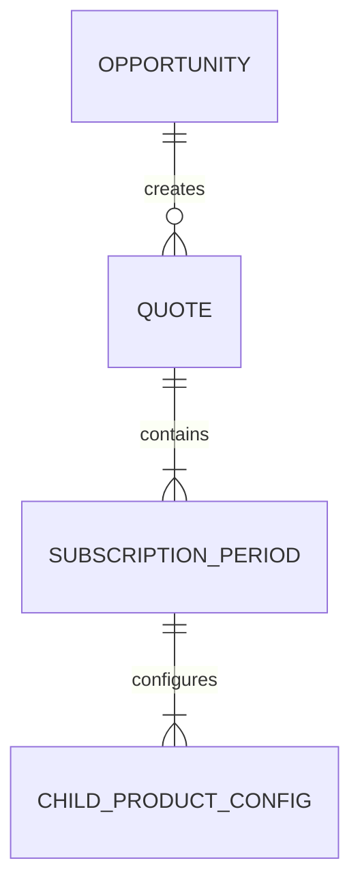
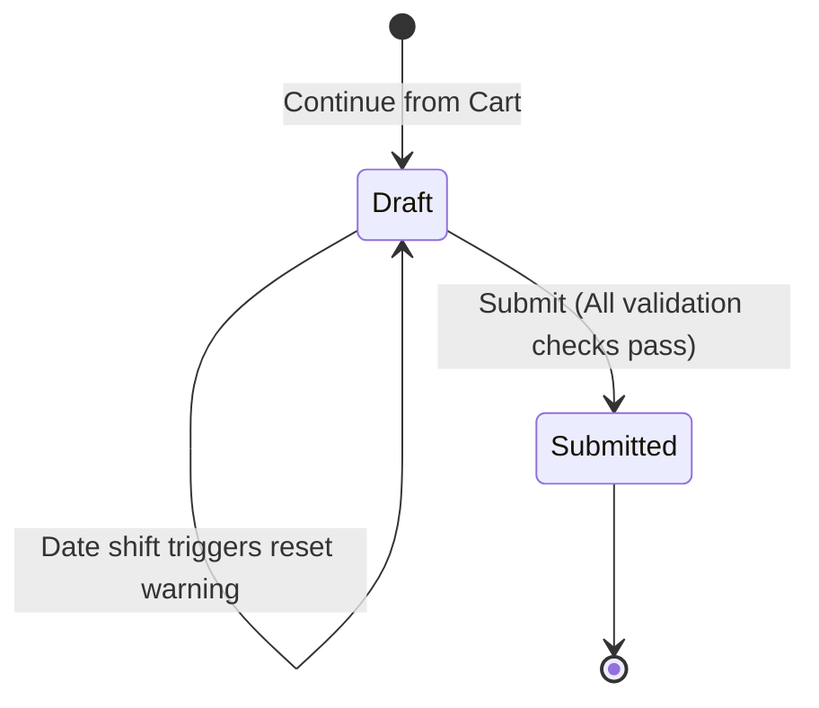

# Data Model: Quote Creation & Subscription Period Configuration Flow

This document details the client-side data schema that supports the Opportunity selection, Catalog, and Quote configuration workflow.

---

## 1. Entity Definitions

### Opportunity
Represents the source CRM opportunity details.

| Field | Type | Description | Constraints |
|:---|:---|:---|:---|
| `id` | String | Unique identifier (e.g., `opp-98124`) | Primary Key |
| `name` | String | Name of the opportunity | Required |
| `accountName` | String | Name of the associated client account | Required |
| `owner` | String | Salesforce owner/rep name | Required |
| `amount` | Number | Monetary value in CAD | Required, non-negative |
| `closeDate` | String | Date of opportunity closing (YYYY-MM-DD) | Required |
| `primaryContact` | Object | Object containing `name` and optional `avatar` | Required |

---

### Quote
Represents the configuration envelope associated with an Opportunity.

| Field | Type | Description | Constraints |
|:---|:---|:---|:---|
| `id` | String | Unique identifier (e.g., `Q-1234`) | Primary Key |
| `opportunityId` | String | Reference to the originating Opportunity | Foreign Key |
| `status` | String | Workflow status (`Draft`, `Submitted`) | Required |
| `configuredProducts` | Array | Names of selected main product bundles | At least one item |
| `primaryContact` | String | Name of primary account contact | Required |
| `salesChannel` | String | Channel origin (`Direct`, `Partner`, etc.) | Defaults to `Direct` |
| `operationType` | String | Type of deal (`New`, `Renewal`, `Upsell`) | Defaults to `New` |
| `expirationDate` | String | Date the quote expires (YYYY-MM-DD) | Defaults to 45 days after creation |
| `billingFrequency` | String | Frequency of billing | Defaults to `Annual in Advance Anniversary` |
| `termStartsOn` | String | Rule for starting term | Defaults to `Fixed Start Date` |
| `termStartDate` | String | Custom start date if `termStartsOn` is `Fixed Start Date` | Required if Fixed |
| `termEndDate` | String | Ending date of subscription term | Required, must be > start date |

---

### SubscriptionPeriod
Represents a temporal segment partitioning the overall subscription term.

| Field | Type | Description | Constraints |
|:---|:---|:---|:---|
| `id` | String | Unique identifier within the quote | Primary Key |
| `quoteId` | String | Reference to parent Quote | Foreign Key |
| `periodName` | String | Human readable label (e.g. `Period 1`) | Required |
| `startDate` | String | Start date of the period (YYYY-MM-DD) | Required |
| `endDate` | String | End date of the period (YYYY-MM-DD) | Required, must be > `startDate` |
| `discountPercentage` | Number | Percentage discount applied to platform bundle | Range `0` to `100` |
| `childProducts` | Array | List of configured child products | Looker Core child items |

---

### ChildProductConfig
Represents Looker Core specific child license quantities, regions, and instance metadata.

| Field | Type | Description | Constraints |
|:---|:---|:---|:---|
| `productLabel` | String | Product name (e.g., `Developer User`) | Required |
| `quantity` | Number | Configured user count | Required, non-negative integer |
| `region` | String | GCP Region dropdown | Mandatory if quantity > 0 |
| `gcpProjectId` | String | Target GCP Project ID | Mandatory if quantity > 0 |
| `lookerInstanceId` | String | Looker server instance ID | Mandatory if quantity > 0 |
| `discountPercentage`| Number | Individual item discount percentage | Range `0` to `100` |
| `basePrice` | Number | Catalog base price per year in CAD | Required |

---

## 2. State Transitions

### Quote Lifecycle

### Transition Guards
1. **Draft -> Submitted**:
   - The overall sum of configured subscription periods must span exactly from `termStartDate` to `termEndDate`.
   - All periods must be strictly contiguous (no gaps, no overlaps).
   - If `quantity` > 0 for any child product, then `region`, `gcpProjectId`, and `lookerInstanceId` must be non-empty strings.
