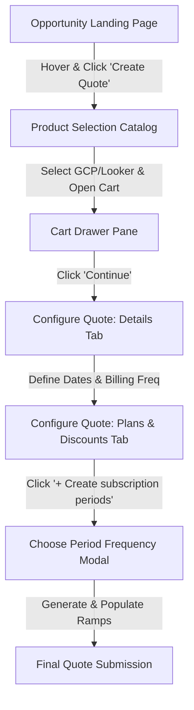
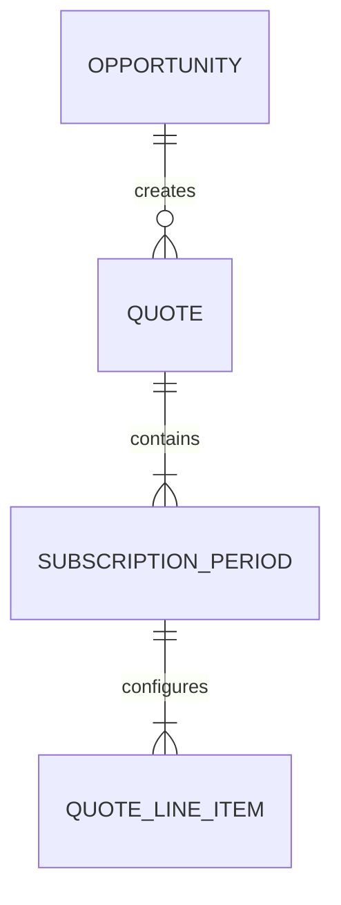

# Feature Specification: Quote Creation & Subscription Period Configuration Flow

**Feature Branch**: `001-quote-subscription-flow`

**Created**: 2026-07-06

**Status**: Ready for Implementation

---

## 1. Executive Summary & Architecture

This feature delivers an integrated sales wizard that allows sales representatives to create quotes from active CRM opportunities, choose product bundles (specifically Google Cloud Platform and Looker Core), define subscription contract dates and billing schedules, and partition the contract term into annual or custom periods.

### System Flow & Navigation
The overall configuration flow spans three distinct sub-features, diagrammed below:



### Detailed Functional Specifications
To ensure clarity and manageability, the feature has been broken down into functional components. Refer to the specific sub-specifications below:

1. **[Opportunity List & Navigation](001-opportunity-list.md)**: Governs the Deal Studio dashboard table, 10-row page pagination controls, hover action menus, and Opportunity state caching.
2. **[Product Selection & Discovery](002-product-selection.md)**: Governs the product catalog keyword search, product family filters (GCP, Workspace, Chrome, Maps, PSO), the cart drawer panel, and the Looker/GCP product rules.
3. **[Quote Details & Subscription Periods Flow](003-subscription-flow.md)**: Governs the double-tab editor, CRM quote details fields, billing/starts-on parameters, payment account cards, period calculations, child products configuration tables (Standard, Developer, Viewer, Non-prod), and data submit validation rules.

---

## 2. Integration & State Management

### Context Passing Lifecycle
- When navigating from the Opportunity List to the Product Selection Page, the `Opportunity ID` and associated `Account Name` must be retained in session state.
- When clicking `Continue` in the cart:
  - A draft Quote record is created on the server:
    ```json
    {
      "opportunityId": "opp-98124",
      "status": "Draft",
      "configuredProducts": ["Looker Core"]
    }
    ```
  - The UI navigates to `/configure-quote/{quoteId}`.
- Switching between the `Details` and `Plans & Discounts` tabs must retain unsaved client-side states in memory. No server calls should occur when swapping tabs.

### Date Sync Rules
- The dates shown under the `Plans & Discounts` tab (`Subscription Start Date` and `Subscription End Date`) must dynamically update to reflect the inputs from the `Details` tab (`Term Start Date` and `Term End Date`).
- If periods are generated, changes to the `Term Start Date` in Tab 1 must trigger a warning dialog. Confirmed changes will reset all configured periods and line items.

---

## 3. Data Flow & Success Criteria

### Key Entity Mapping


### Business Success Metrics
- **SC-001**: End-to-end configuration (Opportunity -> Product -> Period Ramp -> Submit) must take under 3 minutes.
- **SC-002**: Page loading speeds for the catalog and details tabs must remain below 1.5 seconds.
- **SC-003**: Subscription period date splits must calculate immediately (under 500ms) upon clicking Create.
- **SC-004**: No gaps or overlaps can exist in the final submitted period dates.

---

## 4. Key Assumptions & Constraints
- **A-001**: Salesforce REST APIs provide the source of truth for Opportunities, Bundle Products, and Looker Child Products.
- **A-002**: Multi-currency support is omitted for the MVP; all operations default to CAD (or the organization's home currency).
- **A-003**: The total term must represent a clean monthly term (e.g. 12, 24, 36 months) to ensure clean division into yearly periods.
