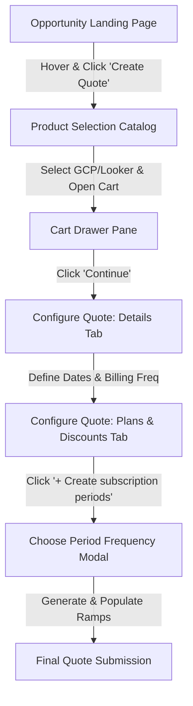
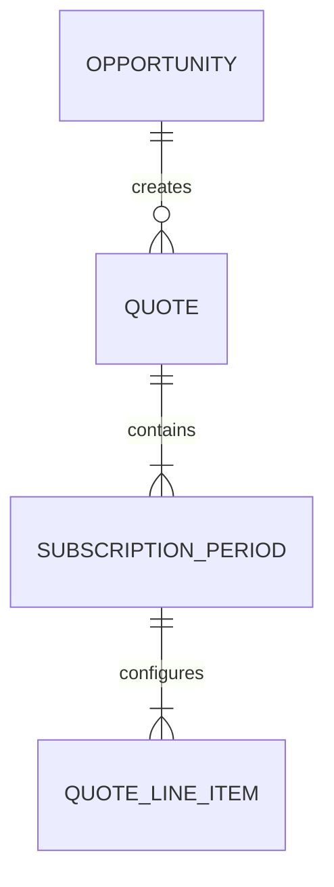

# Feature Specification: Quote Creation & Subscription Period Configuration Flow
 
**Feature Branch**: `001-quote-subscription-flow`
 
**Created**: 2026-07-06
 
**Status**: Ready for Implementation
 
---
 
## 1. Executive Summary & Architecture
 
This feature delivers an integrated sales wizard that allows sales representatives to create quotes from active CRM opportunities, choose product bundles (specifically Google Cloud Platform and Looker Core), define subscription contract dates and billing schedules, and partition the contract term into annual or custom periods.
 
### System Flow & Navigation
The overall configuration flow spans three distinct stages, diagrammed below:
 

 
---
 
## 2. Detailed Functional Specifications
 
### Phase 1: Opportunity List & Navigation
The Opportunity List is the entry page of the **Deal Studio** workspace, presenting a clean Salesforce-style light theme interface with a light grey background (`#f0f2f5`) that occupies the entire viewport height and width (100vw and 100vh) without side margins, padding constraints, or max-width limits.
 
**UI Structure (Landing Page):**
- **Top Navigation Bar / Header**: 
  - Rendered as a horizontal bar with a light grey background (`#f3f4f6`), rounded corners, and a thin border.
  - **Left side**: Hamburger menu icon (`≡`) followed by the "Deal Studio" title.
  - **Middle**: Centralized pill-shaped search input field (placeholder "Search") with a search icon on the right.
  - **Right side**: Icons for Notifications (bell), AI (sparkle), Help (question mark), Settings (gear), and User Profile.
- **Opportunities Card**: 
  - A white background container (`bg-white`) with rounded corners, a soft shadow, and a subtle border.
  - Titled **"Opportunities"** at the top-left.
- **Main Content**: A structured table displaying active opportunity records. Columns include: `Checkbox`, `Opportunity Name` (sortable), `Account Name`, `Owner`, `Amount`, `Close Date`, and an `Action Menu` (`⋮`).
- **Actions Popover**:
  - A light blue-ish grey menu popup (`bg-[#eef2f6]`) with rounded corners and a soft shadow, triggered below the vertical three-dot icon.
  - Contains a single button **"Create Quote"** displaying a circular plus `+` icon.
- **Footer (Pagination)**:
  - Right-aligned at the bottom of the card.
  - `Rows per page` selector dropdown (defaults to `10`).
  - Range and Total indicator (e.g., `1-10 of 33`).
  - Simple navigation control buttons: First Page (`|<`), Previous Page (`<`), Next Page (`>`), Last Page (`>|`).
 
**Interaction & Behavior:**
- **Paginated Loading**: Fetches all opportunity records using **Fetch Opportunities list (GET)** (as detailed in API_SPECIFICATION.md) and paginates them (10 per page by default).
- **Action Menu & Quote Ingress**: The action menu on hover provides a **Create Quote** button. Clicking this takes the user to the Product Selection page, caching the Opportunity ID and associated Account Name in session state.
 
**Data Dictionary & Validation:**
- **Search bar**: Real-time keyword filter on Opportunity list.
- **Rows per page**: Options are `10`, `25`, `50`, `100`.
 
**Edge Cases:**
- *No Opportunities Found*: Display "No opportunities found. Please create an opportunity to start."
- *Network/API Timeout*: Display a red warning toast "Failed to load opportunities. Please refresh the page."
 
### Phase 2: Product Selection & Discovery
Allows sales representatives to discover product bundles, filter them by family, and add them to a cart before creating a formal quote.
 
**UI Structure (Catalog & Cart):**
- **Header**: `← Select products` and full-width search input field.
- **Left Sidebar**: "Product family" filter panel (`GCP`, `Workspace`, `Chrome`, `Maps`, `PSO`).
- **Right Main Panel**: Grouped list of available product bundles showing a title header and individual product cards.
- **Product Card**: Group Header, Product Icon & Label, and `+ Add` button.
- **Cart View (Right Slide-out Drawer)**: Shows `Added products`, list of selected products, and a solid blue `Continue` button.
 
**Interaction & Behavior:**
- **Filtering & Search**: Keyword search filters product cards dynamically. Sidebar filtering limits the view (e.g., selecting `GCP` shows only GCP and Looker Core bundles).
- **Cart Lifecycle**: Clicking `+ Add` slides out the cart drawer, updates the card to `✓ Added`, and adds the item to the cart. Clicking `Continue` validates the cart, creates a Quote record pre-associated with the Opportunity, copies products to Quote Line Items, and navigates to Quote Details.
 
**MVP Scope Constraints:**
Under this MVP, the system strictly supports configuration for the following core product bundles: **Google Cloud Platform (Commit)** and **Looker Core (Subscription)**.
 
**Edge Cases:**
- *Empty Search Results*: Display "No products match your search. Try a different keyword"
 
### Phase 3: Quote Details & Subscription Periods Flow
A split, double-tab interface where the quote properties and temporal ramp schedules are defined and configured. The interface features a Salesforce-style light theme with a light grey background (`#f0f2f5`) and clean sans-serif typography (system-ui / Inter).
 
**UI Structure:**
- **Top Bar**: Shows the account logo/info (e.g., `Cymbal / cymbal.com` on the left with a circular folder icon), a tabbed document interface (`Quote 1` with a `+` tab), and top-right actions:
  - `Preview approval` (outlined button with a user-card icon)
  - `Create contract` (solid blue button `bg-[#0f62fe]` with a document-add icon)
- **Opportunity Reference**: Displays `Opportunity / Opportunity name` in small grey text in the top right corner.
- **Sub-header Details**:
  - Quote Number & Configured Product (e.g., `Q-1234 Looker Core` in large bold dark text on the left).
  - Details panel on the right (neatly aligned columns):
    - `Contract Start Date`: `Upon provisioning` (or calculated date)
    - `Term`: `36 months`
    - `Total Contract Value`: `$X,XXX,XXX` (bold)
    - A vertical three-dots action icon (`⋮`) at the far right.
- **Tab 1 - Details**:
  - **Quote Details Section**:
    - `Primary contact`: Will be prefilled from the opportunity (shows user avatar and name, e.g., "Sarah Connor").
    - `Sales Channel`: Will be prefilled from the opportunity (defaults to `Direct`).
    - `Operation Type`: Defaults to `New`.
    - `Quote Expiration Date`: Defaults to 45 days from creation.
  - **Subscription Details Section**:
    - `Billing Frequency`: Picklist values will be fetched from the API call, and a default value will be prefilled.
    - `Term Starts on`: Picklist values will be fetched from the API call, and a default value will be prefilled.
    - `Term Start Date`: User must manually select.
    - `Term End Date`: User must manually select.
  - **Payment Account Card**: 
    - Bordered container with rounded corners and a soft shadow.
    - Header: **"Payment Account"** with an edit pencil icon on the right.
    - `Primary` pill: Light purple background (`bg-purple-100 text-purple-700`) below the header.
    - Account Details: Account Name `XXX XXXXXX` (bold dark text), `Billing Account`, `Payment Account ID`, `Billing Address`, and `Billing Currency` (CAD).
- **Tab 2 - Plans & Discounts**:
  - `Subscription Start Date` and `Subscription End Date`: Filled from Tab 1. If changed here, the corresponding values in Tab 1 will automatically update to match.
  - **Empty State**: Displays a `+ Create subscription periods` button in the center of a grey card. Text below: `You can choose to create yearly or a custom period`.
  - **Ramp Panel Grid**: Shows collapsible generated periods. Configured rows include:
    - **Platform Child Products**: This category contains 3 child products. Only one platform product can be selected per period. Selecting a platform product from the dropdown is mandatory to proceed with configurations (shows base price like `$5,000.00 / year`).
    - **Users Child Products**: Includes Standard User ($30 / Year), Developer User ($60 / Year), and Viewer User ($30 / Year).
    - **Non-prod**: Contains 3 child products, but they are displayed as a single row dynamically populated based on the selected platform product (Base price `$416.67 / Year`).
    - **Attributes per row**: Quantity, Region, GCP Project ID, Looker Instance ID, and Discount.
    - **Inclusion Rule**: Only rows with a quantity greater than 0 will be added to the final quote.
- **Footer Buttons**: `Cancel` (outlined), `Save` (outlined), `Submit` (solid blue `bg-[#0f62fe]` - disabled until periods are configured).
 
**Interaction & Behavior:**
- **Screen Initialization & Loading APIs**:
  - When the subscription configuration page is loaded, the system must trigger the following API calls:
    - **Fetch Initial Generated Quote Details (GET)** (as detailed in API_SPECIFICATION.md): Called using the cached Quote ID to retrieve initial quote properties (Quote Number, products configured, etc.).
    - **Load Salesforce Form Picklists (GET)** (as detailed in API_SPECIFICATION.md): Fetches dynamic dropdown options for the form fields (Billing Frequency, Term Starts on, and Operation Type).
- **Quote Details Autofill**: `Primary contact` and `Sales Channel` are autofilled via the Opportunity API hook.
- **Period Configuration Generation**:
  - **Yearly**: Calculates the term duration in months and generates N periods (maximum 1 year duration each), bounded by overall term dates sequentially.
  - **Custom**: Allows selecting a specific month duration (e.g., 18 months, 24 months, etc.) and the number of periods accordingly. For example, if a 13-month duration is initially selected, the first period will be created with exactly 12 months, and the second period will cover the remaining 1 month.
  - **Add Period**:
    - For Yearly configurations: Automatically creates a new period appending to the existing periods with a 12-month duration gap, updating the overall `Subscription End Date` automatically.
    - For Custom configurations: Allows adding a period manually by selecting custom start and end dates.
- **Ramp Table Validation Rules**: If a child product quantity > 0, `Region`, `GCP Project ID`, and `Looker Instance ID` are mandatory. The final date of the last period must exactly match the overall `Subscription End Date`. No gaps or overlaps between periods are permitted.
- **Submission**: Clicking the "Submit" button triggers a POST API call that updates the current quote with all configured period details.
 
**Edge Cases:**
- *Mismatch in Term Dates*: Display "Period dates must be contiguous. Please correct the gaps."
- *Submit with Unfilled Mandatory Row Info*: Display "GCP Project ID is required when quantity is greater than 0."
- *Term Date Shift Reset*: If Term Start Date in Tab 1 changes after periods are configured, prompt "Modifying the subscription term dates will clear and reset all configured periods. Do you wish to proceed?"
 
---
 
## 3. Integration & State Management
 
### Context Passing Lifecycle
- Navigating Opportunity List -> Product Selection: `Opportunity ID` and `Account Name` must be retained in session state.
- Clicking `Continue` in the cart creates a draft Quote record on the server:
  ```json
  {
    "opportunityId": "opp-98124",
    "status": "Draft",
    "configuredProducts": ["Looker Core"]
  }
  ```
- The UI navigates to `/configure-quote/{quoteId}`.
- Switching between `Details` and `Plans & Discounts` tabs must retain unsaved client-side states in memory without server calls.
 
### Date Sync Rules
- `Subscription Start Date` and `Subscription End Date` under `Plans & Discounts` tab dynamically update to reflect inputs from `Details` tab (`Term Start Date`, `Term End Date`), and vice versa.
 
---
 
## 4. Data Flow & Success Criteria
 
### Key Entity Mapping

 
### Business Success Metrics
- **SC-001**: End-to-end configuration (Opportunity -> Product -> Period Ramp -> Submit) must take under 3 minutes.
- **SC-002**: Page loading speeds for the catalog and details tabs must remain below 1.5 seconds.
- **SC-003**: Subscription period date splits must calculate immediately (under 500ms) upon clicking Create.
- **SC-004**: No gaps or overlaps can exist in the final submitted period dates.
 
---
 
## 5. Technical Requirements & Integrations
 
- **Salesforce REST APIs Integration**: Salesforce REST APIs **must be used as the definitive source of truth** for Opportunities, Bundle Products, and Looker Child Products. This is a strict technical requirement, not an assumption. All CRM data fetching, including opportunity state, contacts, and account details, will rely directly on these APIs.
- **API Authentication & Access Token**: Before fetching opportunities, an access token must be retrieved from `sessionStorage` (where it is hardcoded to refresh every 2 hours) and passed as a `Bearer` token in the `Authorization` header of all Salesforce API HTTP requests.
- **Term Duration Rule**: The total term must represent a clean monthly term (e.g. 12, 24, 36 months) to ensure clean division into yearly periods.
 
 