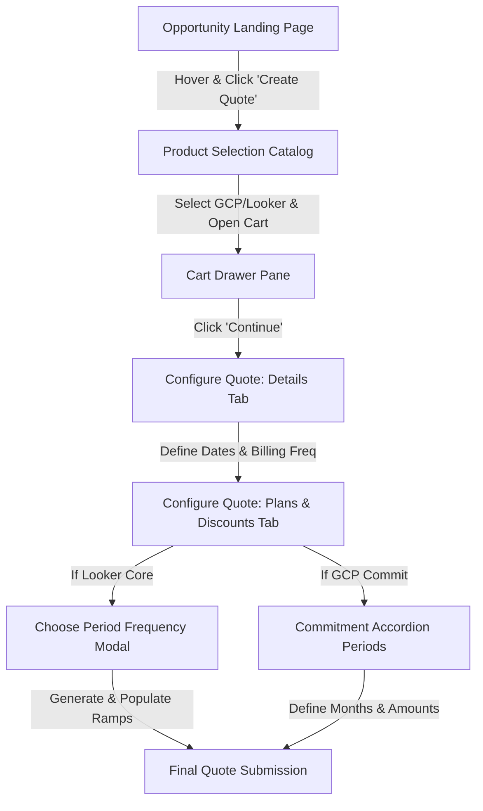
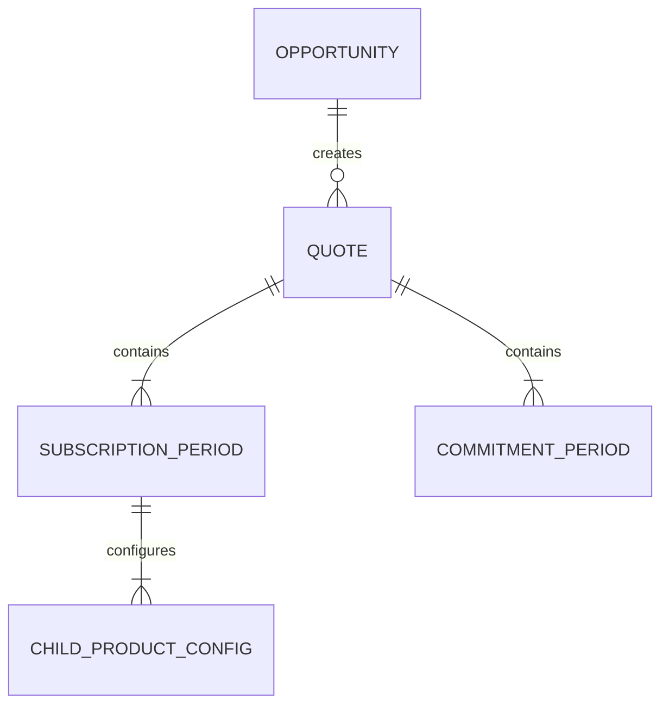

# Feature Specification: Quote Creation, Subscription Period, & GCP Commitment Flow
  
**Feature Branch**: `001-quote-subscription-flow`
  
**Created**: 2026-07-06
  
**Status**: Ready for Implementation
  
---
  
## 1. Executive Summary & Architecture
  
This feature delivers an integrated sales wizard that allows sales representatives to create quotes from active CRM opportunities, choose product bundles (specifically Google Cloud Platform (Commit) and Looker Core (Subscription)), define contract dates and billing schedules, and partition the contract term into yearly/custom subscription periods or monthly accordion commitment periods.
  
### System Flow & Navigation
The overall configuration flow spans three distinct stages, diagrammed below:
  

  
---
  
## 2. Detailed Functional Specifications
  
### Phase 1: Opportunity List & Navigation
The Opportunity List is the entry page of the **Deal Studio** workspace. It provides a tabular overview of sales opportunities in the organization.
  
**UI Structure (Landing Page):**
- **Header**: Contains the "Deal Studio" title on the left, a "Search" input field in the middle, and status/profile icons on the right.
- **Main Content**: A structured table titled "Opportunities" displaying active opportunity records. Columns include: `Checkbox`, `Opportunity Name` (sortable), `Account Name`, `Owner`, `Amount`, `Close Date`, and an `Action Menu` (`⋮`).
- **Footer (Pagination)**: `Rows per page` selector (defaults to `10`), Range and Total indicator, and Pagination navigation buttons.
  
**Interaction & Behavior:**
- **Paginated Loading**: Fetches all opportunity records and paginates them (10 per page by default).
- **Action Menu & Quote Ingress**: The action menu on hover provides a **Create Quote** button. Clicking this takes the user to the Product Selection page, caching the Opportunity ID and associated Account Name in session state.
  
**Data Dictionary & Validation:**
- **Search bar**: Real-time keyword filter on Opportunity list.
- **Rows per page**: Options are `10`, `25`, `50`, `100`.
  
**Edge Cases:**
- *No Opportunities Found*: Display "No opportunities found. Please create an opportunity to start."
- *Network/API Timeout*: Display a red warning toast "Failed to load opportunities. Please refresh the page."
  
### Phase 2: Product Selection & Discovery
Allows sales representatives to discover product bundles, filter them by family, and add them to a cart before creating a formal quote.
  
**UI Structure (Catalog & Cart):**
- **Header**: `← Select products` and full-width search input field.
- **Left Sidebar**: "Product family" filter panel (`GCP`, `Workspace`, `Chrome`, `Maps`, `PSO`).
- **Right Main Panel**: Grouped list of available product bundles showing a title header and individual product cards.
- **Product Card**: Group Header, Product Icon & Label, and `+ Add` button.
- **Cart View (Right Slide-out Drawer)**: Shows `Added products`, list of selected products, and a solid blue `Continue` button.
  
**Interaction & Behavior:**
- **Filtering & Search**: Keyword search filters product cards dynamically. Sidebar filtering limits the view (e.g., selecting `GCP` shows only GCP and Looker Core bundles).
- **Cart Lifecycle**: Clicking `+ Add` slides out the cart drawer, updates the card to `✓ Added`, and adds the item to the cart. Clicking `Continue` validates the cart, creates a Quote record pre-associated with the Opportunity, copies products to Quote Line Items, and navigates to Quote Details.
  
**MVP Scope Constraints:**
Under this MVP, the system strictly supports configuration for the following core product bundles: **Google Cloud Platform (Commit)** and **Looker Core (Subscription)**.
  
**Edge Cases:**
- *Empty Search Results*: Display "No products match your search. Try a different keyword."
  
### Phase 3: Quote Details & Subscription Periods Flow (Looker Core)
A split, double-tab interface where the quote properties and temporal ramp schedules are defined and configured.
  
**UI Structure & Behavior:**
- **Tab 1 - Details**:
  - `Primary contact`: Prefilled from Opportunity.
  - `Sales Channel`: Prefilled from Opportunity.
  - `Operation Type`: Defaults to `New`.
  - `Quote Expiration Date`: Defaults to 45 days from creation.
  - `Billing Frequency`: Fetched from picklists, prefilled default.
  - `Term Starts on`: Defaults to `Fixed Start Date`.
  - `Term Start Date` & `Term End Date`: Date selectors.
- **Tab 2 - Plans & Discounts**:
  - `Subscription Start/End Date`: Linked to Details.
  - **Period Configuration Generation**:
    - **Yearly**: Calculates term duration and generates N periods (max 1 year duration each), bounded by overall term dates.
    - **Custom**: Custom month durations and manual `+ Add Period` operations.
    - **Ramp Panel Grid**: Collapsible generated periods. Contains Platform Child Products, Users Child Products (Standard, Developer, Viewer), Non-prod rows.
    - **Validation**: If child quantity > 0, `Region`, `GCP Project ID`, and `Looker Instance ID` are mandatory. Date sequence must have no gaps/overlaps.
  
### Phase 4: Quote Details & GCP Commitment Flow (Google Cloud Platform)
A split, double-tab interface where commitment accordion periods are configured.
  
**UI Structure & Behavior:**
- **Tab 1 - Details**:
  - `Primary contact` & `Sales Channel` prefilled from Opportunity.
  - `Quote Start Date` defaults to Today.
  - `Quote Expiration Date` is disabled and auto-calculates to start date + 30 days.
- **Tab 2 - Plans & Discounts**:
  - `Subscription Start Date` is filled from Tab 1.
  - `Subscription End Date` is read-only and calculates dynamically based on the sum of all commitment period months.
  - **Commitment Periods List**:
    - Accordion card list supporting up to 5 periods.
    - Headers have expand/collapse, duplicate, and remove controls.
    - Inputs: `Months` (positive integer) and `Amount` (supports shorthand values like `10k`, `2.5M` parsed on blur).
    - Validation: Minimum 1 valid period. Shorthand amounts must be parsed to actual numbers.
  
---
  
## 3. Integration & State Management
  
### Context Passing Lifecycle
- Navigating Opportunity List -> Product Selection: `Opportunity ID` and `Account Name` must be retained in session state.
- Clicking `Continue` in the cart creates a draft Quote record on the server.
- The UI navigates to `/configure-quote/{quoteId}`.
- Switching between `Details` and `Plans & Discounts` tabs must retain unsaved client-side states in memory.
  
### Date Sync Rules
- For Looker: Start/End dates in Tab 2 sync bidirectional with Tab 1. Changing Term Start Date resets configured periods with a warning confirmation.
- For GCP Commit: Start date in Tab 2 syncs from Tab 1. End date is calculated dynamically as $\text{Start Date} + \sum(\text{Period Months}) - 1 \text{ Day}$.

### Quote Tabbed Workspace Navigation
*   **Tab Creation (`+` Tab):**
    *   Clicking the `+` button in the tabs header creates a new independent Draft Quote record associated with the same active opportunity.
    *   The new tab is appended to the right of the active quote tab, labeled `Quote {N}` (where N is the sequential number).
    *   The workspace focus immediately routes to the newly created quote tab, rendering its Details tab in an empty/default state.
*   **Tab Switching:**
    *   Clicking a tab header (e.g., `Quote 1`, `Quote 2`) switches the active workspace state.
    *   The route updates dynamically (e.g., `/configure-quote/{activeQuoteId}`).
    *   Switching tabs preserves all unsaved changes in client-side memory for the inactive tabs.
*   **Tab Closing (`x` Close button):**
    *   Active and inactive tabs display a small hover-triggered close `x` icon next to the tab label.
    *   Clicking the close `x` icon triggers a confirmation modal if there are unsaved draft changes: *"You have unsaved changes in Quote {N}. Closing this tab will discard them. Do you want to proceed?"*
    *   On confirm, the quote is removed from the active session. If it was the active tab, workspace focus redirects to the next remaining tab (or redirects to the Opportunity landing page if no tabs remain).
*   **Tab Cloning (Actions Menu):**
    *   Clicking the vertical three-dots action icon in the sub-header displays a context menu option: **Clone Quote**.
    *   Selecting "Clone Quote" copies the current tab's entire configuration state (Dates, Contact, Billing parameters, and all configured periods) into a new tab labeled `Quote {N} (Copy)`.
  
---
  
## 4. Data Flow & Success Criteria
  
### Key Entity Mapping

  
### Business Success Metrics
- **SC-001**: End-to-end configuration must take under 3 minutes.
- **SC-002**: Page loading speeds for the catalog and details tabs must remain below 1.5 seconds.
- **SC-003**: Subscription period date splits must calculate immediately (under 500ms).
- **SC-004**: GCP Commitment shorthand currency parsing must execute instantly on blur.
  
---
  
## 5. Technical Requirements & Integrations
  
- **Salesforce REST APIs Integration**: Salesforce REST APIs are the definitive source of truth for CRM entities. All endpoint details, query strings, and schemas are defined in [API_SPECIFICATION.md](../API_SPECIFICATION.md).
- **API Authentication & Access Token**: Authentication token resolution is managed dynamically via a local Node.js relay server. For endpoint specs, relay configurations, and response schemas, refer to the Authentication Sequence in [API_SPECIFICATION.md](../API_SPECIFICATION.md#authentication-sequence-local-token-relay-service).
- **Composite Graphs & Trees**: Quote submissions use Salesforce Composite Graphs/Trees to update the root Quote record and save child details. Schema details and payload formats are defined in [API_SPECIFICATION.md](../API_SPECIFICATION.md).

---

## 6. Shared Global UI Components

To ensure visual consistency and a premium experience, the application uses standardized global components for transient alerts and system loading states.

### 6.1 Toast Notification Component (`ToastComponent`)
Used for asynchronous feedback (success, warning, error messages).

*   **Layout & Placement:**
    *   Positioned in the bottom-right corner of the viewport (`fixed bottom-6 right-6`).
    *   Toast cards stack vertically with a `gap-3`.
*   **Visual Styling (Aesthetics):**
    *   **Theme:** Dark glassmorphism card (`background: rgba(30, 41, 59, 0.85)` with `backdrop-filter: blur(12px)`).
    *   **Border:** `1px solid rgba(255, 255, 255, 0.08)`.
    *   **Shadow:** Deep premium elevation (`box-shadow: 0 10px 25px -5px rgba(0, 0, 0, 0.3)`).
    *   **Text:** High-contrast slate primary text (`#f8fafc`), with muted description details (`#94a3b8`).
*   **Variant Badges & Icons:**
    *   **Success:** Checkmark icon with green accent tint (`#22c55e`).
    *   **Warning:** Alert triangle icon with orange/amber accent tint (`#f59e0b`).
    *   **Error:** Error X icon with red accent tint (`#ef4444`).
*   **Interactions & Animations:**
    *   **Entrance:** Slide in from right and fade in over `200ms` using `cubic-bezier(0.16, 1, 0.3, 1)`.
    *   **Dismissal:** Auto-dismisses after `4000ms`. Triggers a smooth slide-out to the right and fade-out over `200ms`.
    *   **Manual Close:** Displays a small close icon (`x`) on hover to dismiss instantly.

### 6.2 Global Loading Overlay Component (`LoadingSpinnerComponent`)
Used to block page interaction during asynchronous API requests or submission processing.

*   **Layout & Placement:**
    *   Fullscreen fixed overlay (`fixed inset-0 z-50 flex items-center justify-center`).
*   **Visual Styling (Aesthetics):**
    *   **Backdrop:** Frosted glass overlay (`background: rgba(15, 23, 42, 0.65)` with `backdrop-filter: blur(6px)`).
*   **Spinner Graphics:**
    *   Circular SVG spinner track with a gradient or indigo accent stroke (`#6366f1`).
    *   Indeterminate dash-array animation rotating infinitely (`animation: spin 1s linear infinite`).
*   **Interactions:**
    *   Blocks all cursor pointer events on the underlying page components.
    *   Blocks keyboard tab focus navigation while active.
    *   Smoothly fades in/out on toggle via `opacity` transition over `150ms`.